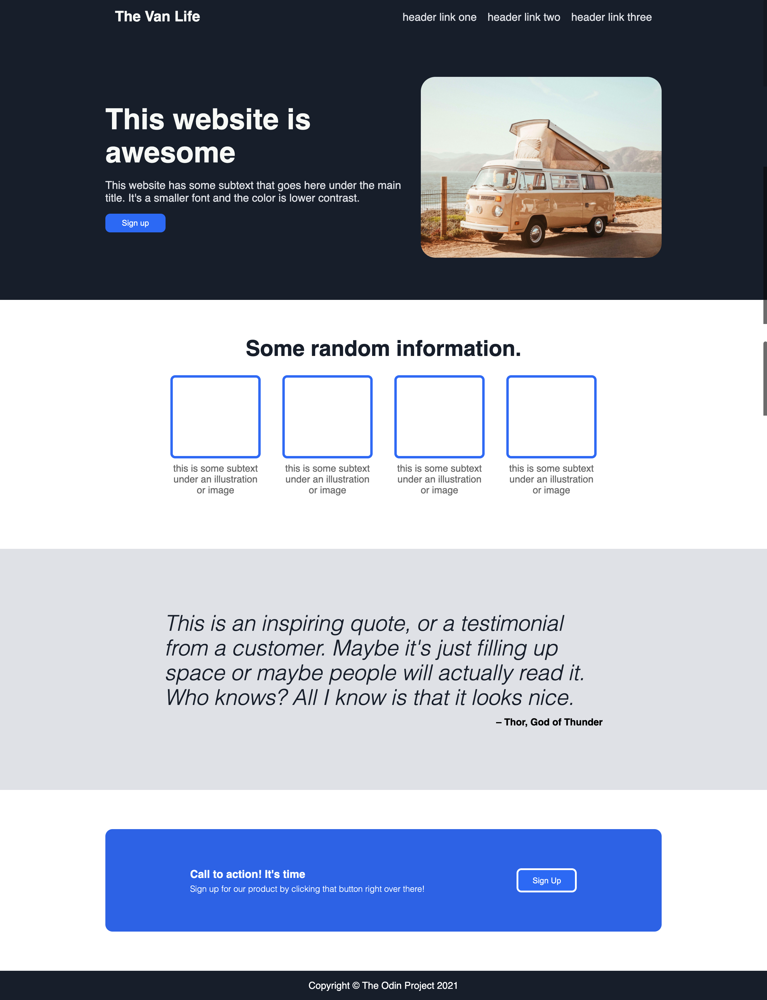
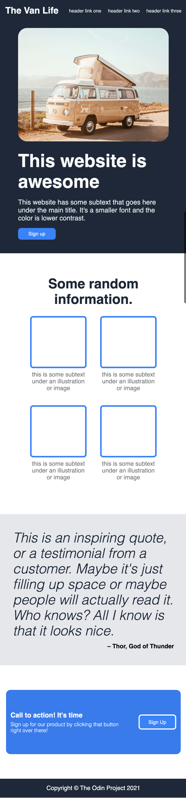

# Odin Project Landing Page

A simple landing page in HTML and CSS. Part of the Foundations course by The Odin Project.

This exercise is a part of the Odin Project fundamentals course and is meant to demonstrate the use of flexbox in creating more complex layouts.

# To-do

Although this project is complete, there are some things that can still be improved:

- [ ] responsive navigation bar on mobile

# Screenshots
Full Screen             |  Mobile
:-------------------------:|:-------------------------:
  |  

<!-- 

  
  

 -->